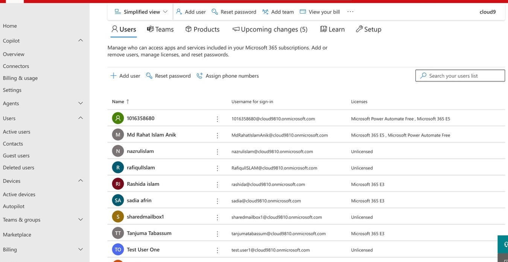
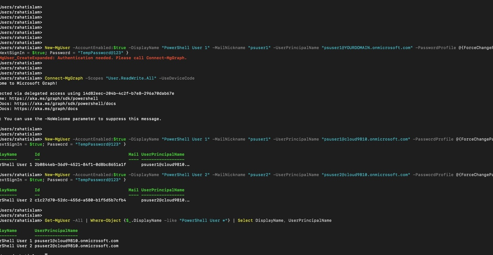
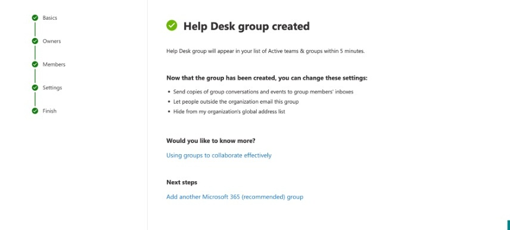
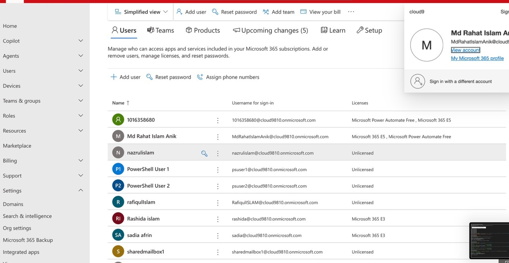

# Microsoft 365 Identity & Messaging Administration

### Entra ID · Exchange Online · SharePoint · PowerShell Automation · Security Governance

**Md Rahat Islam Anik · George Brown College · Cloud Computing Technologies (T465) · Postgraduate**

---

## Overview

This project covers hands-on Microsoft 365 administration across identity, messaging, collaboration, and security governance — with PowerShell automation running alongside portal configuration throughout.

The work reflects the administrative layer that keeps an M365 tenant operational: user and license lifecycle management via Entra ID, Exchange Online mailbox and group configuration, SharePoint and OneDrive access governance, tenant-level security and compliance settings, and scripted automation using the Microsoft Graph and Exchange Online PowerShell modules.

The PowerShell angle is deliberate. Portal-only administration doesn't scale. These scripts demonstrate the ability to move beyond the GUI and operate at the command line — the way enterprise M365 administrators actually work.

---

## What Was Built

### Microsoft Entra ID — Identity & Access Management

User accounts, security groups, and Microsoft 365 groups were created and managed through Microsoft Entra ID (Azure AD). Role-Based Access Control (RBAC) was applied to assign administrative permissions at the appropriate scope — ensuring users hold only the access their role requires.

Microsoft 365 licenses were assigned and managed across accounts, with license states verified through both the Admin Center and PowerShell output.

### Exchange Online — Messaging Administration

Shared mailboxes were created and configured for team access scenarios — allowing multiple users to send from and monitor a common mailbox without shared credentials. Distribution groups were set up for department-level email routing, with membership and delivery settings configured and verified.

### SharePoint Online & OneDrive — Collaboration Governance

SharePoint Online site administration and OneDrive access policies were configured at the tenant level. Access controls were applied to govern who can share, view, and manage content across the collaboration layer.

### Security & Compliance — Tenant Governance

Security and compliance settings were configured through the Microsoft 365 Security & Compliance Center. Tenant-level governance controls were applied to enforce organizational policy across the environment.

### PowerShell Automation — Microsoft Graph & Exchange Online Modules

PowerShell was used throughout this project to automate administrative tasks that would otherwise require repetitive portal interaction. Using the Microsoft Graph PowerShell SDK and Exchange Online Management Module:

- **User creation** — accounts provisioned via script with correct attributes and license assignments
- **Group management** — Help Desk and distribution groups created and populated via command line
- **Verification** — user and group states queried and confirmed through PowerShell output

This scripting approach reflects how enterprise M365 administrators handle bulk operations, onboarding automation, and audit-ready provisioning — not one-off portal clicks, but repeatable, documented commands.

---

## Tech Stack

| Category | Tools & Services |
|---|---|
| Identity & Access | Microsoft Entra ID (Azure AD) · RBAC |
| Messaging | Exchange Online · Shared Mailboxes · Distribution Groups |
| Collaboration | SharePoint Online · OneDrive for Business |
| Administration | Microsoft 365 Admin Center · Security & Compliance Center |
| Automation | PowerShell · Microsoft Graph Module · Exchange Online Module |

---

## Skills Demonstrated

`Microsoft 365 Administration` · `Entra ID` · `Identity & Access Management` · `Exchange Online` · `Shared Mailboxes` · `Distribution Groups` · `SharePoint Online` · `OneDrive Governance` · `PowerShell Automation` · `Microsoft Graph SDK` · `RBAC` · `License Management` · `Security & Compliance Governance`

---

## Screenshots

### Microsoft 365 Admin Center — Users

### PowerShell — Create Microsoft 365 Users

### Microsoft 365 — Help Desk Group Created

### PowerShell — Verify Users

### Project Overview

---

## Author

**Md Rahat Islam Anik**
Cloud Computing & Network Administration · George Brown College · May 2026

